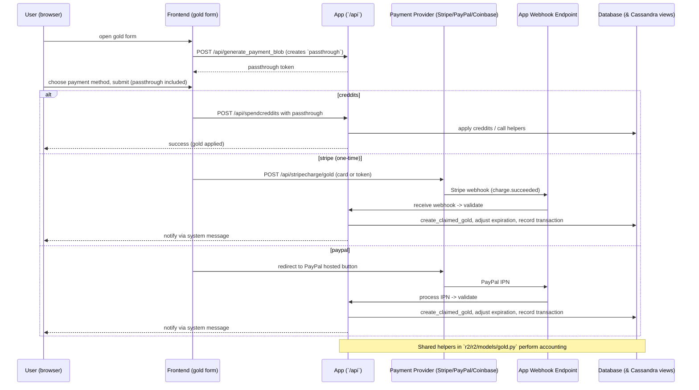

# Gold payments — Overview and flow

This document describes how gold (one-time purchases, gifts, creddits, and subscriptions) are processed in the codebase.

Files of interest

- `r2/r2/templates/goldpayment.html` — checkout UI and payment form templates.
- `r2/r2/public/static/js/gold.js` — client-side logic that builds the form and posts to server endpoints.
- `r2/r2/controllers/api.py` — `POST_generate_payment_blob` (creates short-lived payment blob/passthrough token).
- `r2/r2/controllers/ipn.py` — webhook, IPN and shared gold-completion logic (includes Stripe and PayPal handling, `complete_gold_purchase`, `send_gift`, etc.).
- `r2/r2/models/gold.py` — storage schema and helper functions (`create_claimed_gold`, `create_gold_code`, `claim_gold`, accounting helpers).

Summary flow (high level)

1. Frontend displays a gold form (from `goldpayment.html`). The client can request a short-lived payment blob by calling `POST /api/generate_payment_blob` which returns a token (`passthrough`). The token encodes the intended gold action (gift/onetime/code) and some metadata.
2. User selects a payment provider (creddits, PayPal, Stripe, Coinbase). The purchase forms carry the `passthrough` token.
3. Provider-specific flows:
   - Creddits: client posts to `/api/spendcreddits` handled by `POST_spendcreddits` in `ipn.py` — processed immediately on the server.
   - Stripe (cards/subscriptions): client posts card data to `/api/stripecharge/gold` (StripeController) which creates a Stripe customer/charge using `stripe` library and returns status. Stripe then sends webhooks to the server; StripeController processes the webhook and, when successful, calls the shared completion routine.
   - PayPal: hosted button flow + IPN callback. PayPal IPNs are received and processed via IPN handlers in `ipn.py` and mapped into the same completion logic.
   - Coinbase/Bitcoin: handled by coinbase flow and corresponding webhook endpoint; mapped into the same completion logic.
4. The shared handler (`complete_gold_purchase`) validates the payment, credits creddits or gold, applies subscriptions or gifts, creates a DB transaction (`create_claimed_gold`) and sends notification messages.

Mermaid sequence diagram

Notes and troubleshooting

- The server uses `payment_blob` (short-lived blob in hardcache) to pass user/intent data between the UI and backend processing. See `generate_blob` / `get_blob` in `r2/r2/controllers/ipn.py` and `POST_generate_payment_blob` in `r2/r2/controllers/api.py`.
- Stripe flows create a `stripe.Customer` and `Charge`; the webhook handler maps Stripe event types to the internal event types and calls `complete_gold_purchase`.
- For gift codes and unclaimed purchases the code paths in `r2/r2/models/gold.py` (`create_gold_code`, `claim_gold`, `create_unclaimed_gold`) manage code generation and claiming later.
- Creddits are an internal balance (see `gold_creddits` counters) and are cheaper in bulk; spending triggers the same internal helpers to apply gold.

Quick pointers to trace a real purchase

- Start at `r2/r2/templates/goldpayment.html` to see the UI and which form fields are posted.
- `r2/r2/public/static/js/gold.js` contains the client event wiring (`generate_payment_blob` call, `modify_payment_blob`, and which endpoints are POSTed).
- For Stripe one-time: `r2/r2/controllers/ipn.py::POST_goldcharge` (creates Stripe customer/charge) and `StripeController.process_response` for webhook processing.
- For PayPal IPN: `r2/r2/controllers/ipn.py` IPN handlers and `check_txn_type` / `check_payment_status` helpers used to normalize inputs.

If you'd like, I can:
- Add a PNG/SVG version of the diagram under `docs/diagrams/`.
- Expand this doc with a step-by-step example (Stripe one-time gift) including sample payloads and DB rows.
